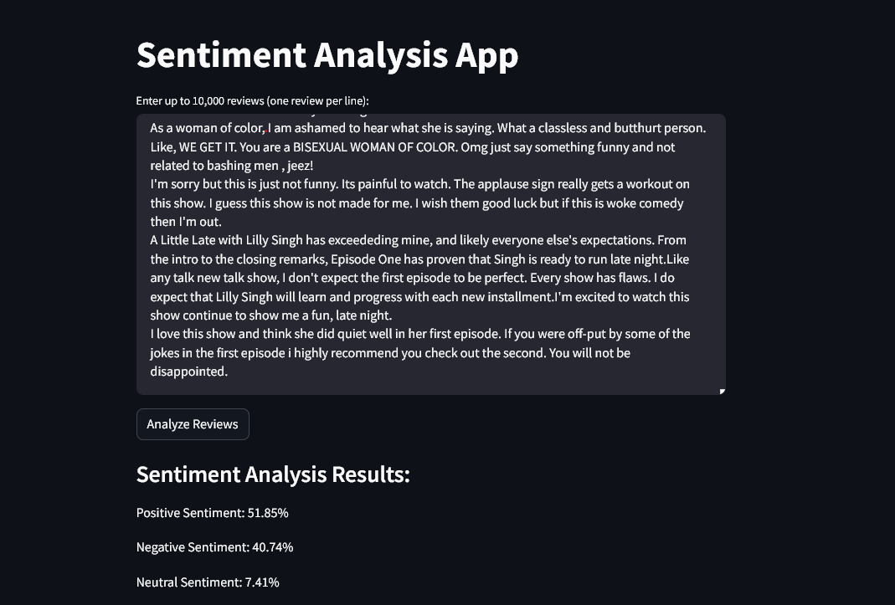
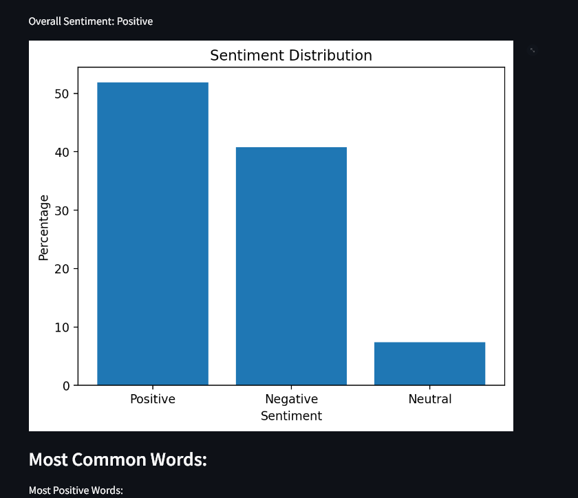
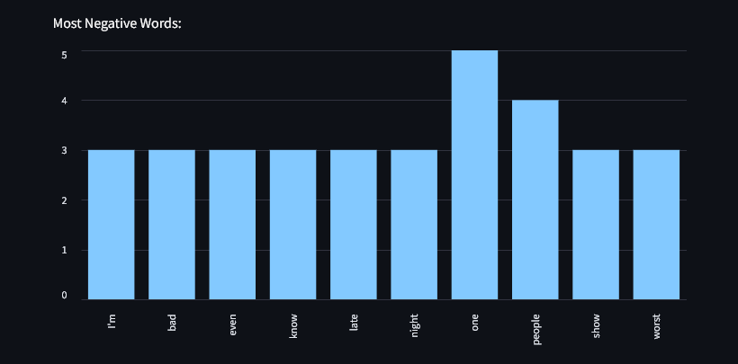
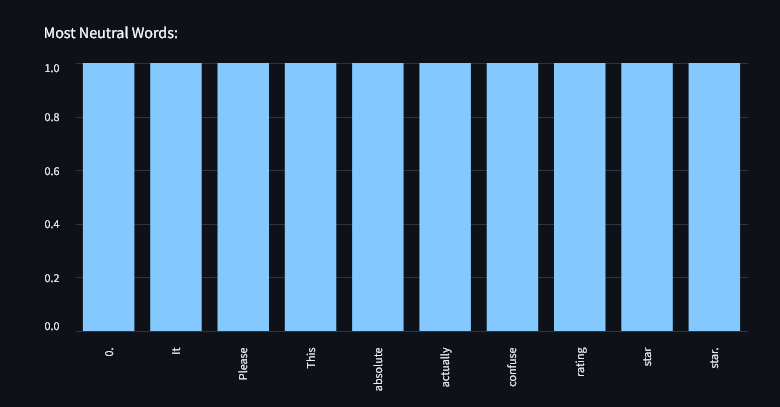
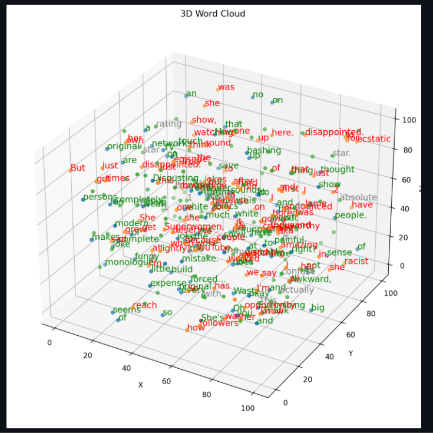

# Alexandria University - Institute of Graduate Studies and Research  
## Department of Information Technology  
### Master Program in Information Technology  
#### Course Title: Data Analytics

    

---

# Sentiment Analysis Project

## Project Overview

This project is a comprehensive analysis of public sentiment on social media regarding movies. The aim is to provide valuable insights to stakeholders in the film industry, such as filmmakers, marketers, and critics, by understanding how people feel about various movies based on their social media activity. The project leverages advanced sentiment analysis tools in Python to assess the overall sentiment (positive, negative, or neutral) expressed in movie-related posts.

### Key Objectives:

- **Comprehensive Analysis**: The project analyzes a large dataset of social media posts to determine the general sentiment towards various movies. 
- **Industry Insights**: By examining public opinion, the project aims to provide the film industry with actionable insights that can inform marketing strategies, production decisions, and audience engagement efforts.
- **Data-Driven Approach**: The sentiment analysis is conducted using Python, employing advanced tools and techniques to ensure accurate and reliable results.

## Documentation

Detailed documentation is available to guide you through the project's various stages, from data wrangling to the final analysis:

- **[Data Wrangler Report](project_documents/Data%20analytics%20project%20..group%207.pdf)**:  
  This report outlines the data wrangling process, detailing the methods used to clean, transform, and prepare the data for sentiment analysis.

- **[Acceptance Criteria Test](project_documents/Data%20analytics%20project.pdf)**:  
  This document provides the criteria used to validate the analysis, ensuring that the project meets the required standards for accuracy and relevance.

- **[Link to Dataset](https://www.kaggle.com/datasets/crisbam/imdb-dataset-of-65k-movie-reviews-and-translation)**:  
  The dataset used in this project is sourced from Kaggle, containing 65,000 movie reviews that serve as the basis for the sentiment analysis.

    
    
    
    
    
    
    
    

---

## Running the Application

For instructions on how to run the application, please refer to the [HOW TO RUN THE APP](HOW%20TO%20RUN%20THE%20APP.txt) guide.

---

## Alexandria University - IGSR - All rights reserved